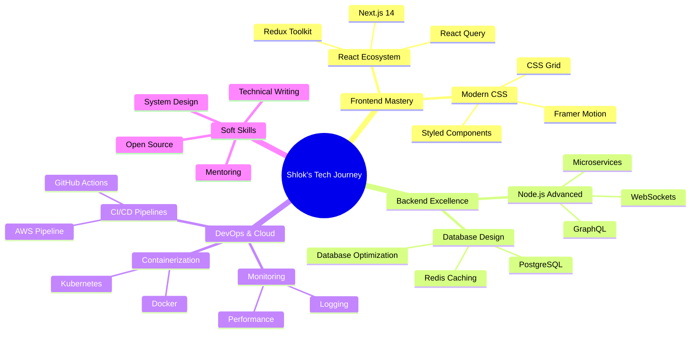

<div align="center">
  
</div>

<p align="center">
  
</p>

<div align="center">
  
  
  
  
  
  <h2>🏠 Pune, Maharashtra • 🎓 Computer Science Student • 💻 Full-Stack Developer</h2>
  
</div>

---


## 🚀 About Me

> *"Code is like humor. When you have to explain it, it's bad."* – Cory House

```typescript
interface Developer {
  name: string;
  location: string;
  role: string;
  experience: string;
  passions: string[];
  currentFocus: string[];
}

const shlok: Developer = {
  name: "Shlok Garg",
  location: "Pune, India 🇮🇳",
  role: "Full-Stack Developer & Problem Solver",
  experience: "Building scalable web applications",
  
  passions: [
    "Clean, maintainable code 🧹",
    "User-centric design 🎨",
    "Performance optimization ⚡",
    "Open source contribution 🤝"
  ],
  
  currentFocus: [
    "Mastering React ecosystem",
    "Cloud architecture patterns",
    "DevOps & CI/CD pipelines",
    "System design principles"
  ]
};

console.log("Always learning, always growing! 🌱");
```

### 🎯 What Drives Me

- 🔥 **Building** scalable, performant web applications that users love
- 🌱 **Learning** cutting-edge technologies and best practices daily
- 🤝 **Collaborating** on innovative projects that make a difference
- 💡 **Problem-solving** complex challenges with elegant solutions
- 📧 **Connect with me** at [shlokgarg2212@gmail.com](mailto:shlokgarg2212@gmail.com)
- ⚡ **Philosophy** "Perfect is the enemy of good, but good is the enemy of great!"

<br clear="right"/>

---

## 🛠️ Technology Arsenal

<div align="center">

### 💻 Core Technologies
<table>
<tr>
<td align="center" width="200px">
<br>
<strong>JavaScript/TypeScript</strong><br>
<sub>ES6+, Async/Await, DOM</sub>
</td>
<td align="center" width="200px">
<br>
<strong>Python/C++</strong><br>
<sub>Data Structures, Algorithms</sub>
</td>
<td align="center" width="200px">
<br>
<strong>Node.js/Express</strong><br>
<sub>RESTful APIs, Middleware</sub>
</td>
<td align="center" width="200px">
<br>
<strong>React/Next.js</strong><br>
<sub>Hooks, Context, SSR</sub>
</td>
</tr>
</table>

### 🎨 Frontend & Design


### 🔧 Backend & Database


### ☁️ DevOps & Cloud


</div>

---

## 📊 GitHub Analytics

<div align="center">
  
  
</div>

<div align="center">
  
</div>

<div align="center">
  
</div>

---

## 🏆 Achievements & Recognition

<div align="center">
  
</div>

---

## 🎯 2024 Roadmap & Learning Journey

<div align="center">



</div>

### 📋 Current Sprint (Q3 2024)

<div align="center">

| 🎯 Goal | 📈 Progress | 🎯 Target Date |
|---------|------------|----------------|
| **React Mastery** | `████████░░` 80% | Sep 2024 |
| **Docker Proficiency** | `██████░░░░` 60% | Aug 2024 |
| **AWS Fundamentals** | `████░░░░░░` 40% | Oct 2024 |
| **System Design** | `███░░░░░░░` 30% | Nov 2024 |
| **Open Source Contributions** | `██░░░░░░░░` 20% | Dec 2024 |

</div>

---

## 🚀 Featured Projects

<div align="center">

<table>
<tr>
<td width="50%">

### 🌟 Project Showcase
*Coming Soon - Building something amazing!*

**Tech Stack:** React, Node.js, MongoDB  
**Features:** 
- Modern UI/UX design
- Real-time functionality  
- Responsive & optimized
- Clean architecture

[🔗 Live Demo](#) | [💻 Source Code](#)

</td>
<td width="50%">

### 🎨 Creative Solutions
*Innovation in progress...*

**Tech Stack:** Next.js, TypeScript, Tailwind  
**Features:**
- Server-side rendering
- Type-safe development
- Mobile-first design
- Performance optimized

[🔗 Live Demo](#) | [💻 Source Code](#)

</td>
</tr>
</table>

</div>

---

## 💭 Dev Philosophy

<div align="center">

> ### *"The best code is not just functional, but readable, maintainable, and elegant."*

<table>
<tr>
<td align="center">

<br><strong>Clean Code</strong>
<br><sub>Readable & Maintainable</sub>
</td>
<td align="center">

<br><strong>User Experience</strong>
<br><sub>Intuitive & Accessible</sub>
</td>
<td align="center">

<br><strong>Performance</strong>
<br><sub>Fast & Optimized</sub>
</td>
<td align="center">

<br><strong>Innovation</strong>
<br><sub>Creative & Modern</sub>
</td>
</tr>
</table>

</div>

---

## 🌐 Let's Connect & Collaborate

<div align="center">

[](https://linkedin.com/in/shlok-garg-524991320)
[](https://x.com/Shlok_Garg_07)
[](mailto:shlokgarg2212@gmail.com)
[](#)

### 🤝 Open for:
- **Freelance Projects** • **Collaboration** • **Mentorship** • **Tech Discussions**

### 📝 Latest Blog Posts
<!-- BLOG-POST-LIST:START -->
*Coming Soon - Setting up my tech blog!*
<!-- BLOG-POST-LIST:END -->

<br/>

### 💡 *"In a world of algorithms, be the human who writes them with purpose."*

**⭐ Found something interesting? Star my repositories and let's build the future together!**

</div>

---

<div align="center">
  
  
  
  
</div>
