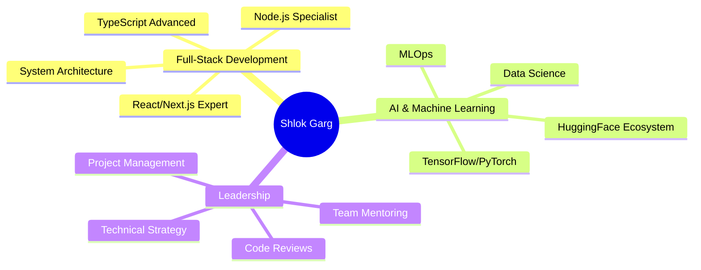

# 🚀 Shlok Garg | Full-Stack Architect & AI Innovator

<div align="center">
  
</div>

<div align="center">
  
</div>

<div align="center">
  <a href="https://linkedin.com/in/shlok-garg-524991320">
    
  </a>
  <a href="mailto:shlokgarg2212@gmail.com">
    
  </a>
  <a href="https://x.com/Shlok_Garg_07">
    
  </a>
  <a href="https://huggingface.co/ShlokGarg22">
    
  </a>
</div>

<div align="center">
  
</div>

---

## 🎭 **Executive Profile**


```javascript
class ShlokGarg extends Developer {
  constructor() {
    super();
    this.name = "Shlok Garg";
    this.location = "Pune, India 🇮🇳";
    this.title = "Senior Full-Stack Developer & AI Architect";
    this.email = "shlokgarg2212@gmail.com";
    this.experience = "3+ Years";
    this.specialties = [
      "Enterprise Web Applications",
      "AI/ML Integration",
      "System Architecture",
      "Performance Optimization"
    ];
  }

  getCurrentFocus() {
    return [
      "Building scalable microservices architecture",
      "Implementing cutting-edge AI solutions",
      "Contributing to open-source AI community",
      "Mentoring upcoming developers"
    ];
  }

  getPhilosophy() {
    return "Innovation through code, Impact through technology ⚡";
  }
}

const shlok = new ShlokGarg();
```

---

## 🛡️ **Technology Mastery**

<div align="center">

### 🎨 **Frontend Excellence**
<p>
  
</p>

### ⚡ **Backend Powerhouse**
<p>
  
</p>

### 🤖 **AI & Data Science Arsenal**
<p>
  
  
  
  
  
</p>

### 🗄️ **Database & Cloud Mastery**
<p>
  
</p>

### 🛠️ **Development Ecosystem**
<p>
  
</p>

</div>

---

## 📊 **Performance Analytics**

<div align="center">
  


</div>

<div align="center">
  
</div>

---

## 🏆 **Achievement Gallery**

<div align="center">
  
</div>

---

## 📈 **Contribution Heatmap**

<div align="center">
  
</div>

---

## 🎯 **Current Mission Control**

<table align="center">
<tr>
<td width="50%">

### 🔭 **Active Projects**
- **Enterprise SaaS Platform** - Leading full-stack development
- **AI-Powered Analytics Dashboard** - Implementing ML models
- **Open Source Contributions** - HuggingFace ecosystem
- **Mobile App Architecture** - React Native + Node.js

### 🌱 **Continuous Learning**
- **Advanced Machine Learning** - Neural Networks & Deep Learning
- **Cloud Architecture** - AWS Solutions Architect
- **System Design** - Scalable distributed systems
- **Leadership Skills** - Technical team management

</td>
<td width="50%">


### 💡 **Innovation Focus**
- **AI Integration** in web applications
- **Performance Optimization** for enterprise solutions
- **Developer Experience** improvements
- **Sustainable Code** practices

</td>
</tr>
</table>

---

## 🌟 **Professional Highlights**

<div align="center">



</div>

---

## 📱 **Digital Presence**

<div align="center">

[](https://your-portfolio-link.com)
[](https://your-blog-link.com)
[](https://your-resume-link.com)

</div>

---

## 🎮 **GitHub Insights**

<div align="center">
  

[](https://github.com/ShlokGarg22?tab=followers)


</div>

---

## 🎨 **Code Philosophy**

<div align="center">
  
</div>

<div align="center">
  
*"Great software is not built by individuals, but by teams that share a vision of excellence and a commitment to continuous innovation."* 

**— Shlok Garg**

</div>

---

## 📬 **Let's Build Something Extraordinary Together**

<div align="center">
  
### 🤝 **Open for Collaboration**
- **Enterprise Projects** - Scalable web applications
- **AI/ML Initiatives** - Intelligent software solutions  
- **Open Source** - Contributing to the developer community
- **Mentorship** - Guiding the next generation of developers

### 📞 **Get In Touch**

<a href="mailto:shlokgarg2212@gmail.com">
  
</a>

<a href="https://linkedin.com/in/shlok-garg-524991320">
  
</a>

<a href="https://calendly.com/shlokgarg22">
  
</a>

</div>

---

<div align="center">
  
</div>

<div align="center">
  
**⭐ Star this profile if you found it inspiring! Let's connect and build the future together! ⭐**

</div>
