<div align="center">
  
</div>

<p align="center">
  
</p>

<div align="center">
  
  
  
  
  
  <h3>📍 Pune, Maharashtra • 🎓 Student • 💻 Web Developer</h3>
  
</div>

---


## 👨‍💻 About Me

```javascript
const shlok = {
    name: "Shlok Garg",
    location: "Pune, India 🇮🇳",
    role: "Student & Aspiring Full-Stack Developer",
    
    code: ["JavaScript", "Python", "C/C++", "HTML/CSS"],
    technologies: {
        frontEnd: ["HTML5", "CSS3", "JavaScript", "Tailwind CSS"],
        backEnd: ["Node.js", "Express.js"],
        databases: ["MongoDB"],
        tools: ["Git", "VS Code", "Vite", "Postman"],
        cloud: ["Vercel", "Cloudflare"]
    },
    
    currentlyLearning: ["React.js", "DevOps", "System Design"],
    
    goals: [
        "Master full-stack development",
        "Contribute to open source",
        "Build impactful projects",
        "Never stop learning"
    ],
    
    funFact: "I debug with console.log() and I'm proud of it! 😄"
};
```

### 🎯 What I'm Currently Up To

- 🔭 **Building** fast, responsive web applications with modern JavaScript
- 🌱 **Learning** React.js, advanced backend concepts, and cloud technologies  
- 👯 **Looking to collaborate** on interesting web projects and open source
- 💬 **Ask me about** JavaScript, Node.js, web development, or programming in general
- 📫 **Reach me at** [shlokgarg2212@gmail.com](mailto:shlokgarg2212@gmail.com)
- ⚡ **Fun fact** I can spend hours optimizing code that saves milliseconds!

<br clear="right"/>

---

## 🛠️ Tech Stack & Skills

<div align="center">

### Languages & Frameworks


### Frontend Technologies


### Database & Tools


### Currently Learning


</div>

---

## 📊 GitHub Performance

<div align="center">
  
  
</div>

<div align="center">
  
</div>

<div align="center">
  
</div>

---

## 🏆 Achievements

<div align="center">
  
</div>

---

## 🎯 Learning Journey & Goals

<div align="center">

### 🚀 2024 Learning Path

```mermaid
flowchart TD
    A[🎯 Current Skills] --> B[JavaScript Mastery]
    A --> C[Backend Development]
    A --> D[Database Management]
    
    B --> E[🔥 Learning Now]
    C --> E
    D --> E
    
    E --> F[React.js]
    E --> G[DevOps & Docker]
    E --> H[System Design]
    
    F --> I[🚀 Future Goals]
    G --> I
    H --> I
    
    I --> J[Full-Stack Mastery]
    I --> K[Open Source Contributor]
    I --> L[Cloud Architecture]
    
    style A fill:#58a6ff,stroke:#1a1b27,color:#fff
    style E fill:#f7931e,stroke:#1a1b27,color:#fff
    style I fill:#32d74b,stroke:#1a1b27,color:#fff
```



</div>

### 📋 Current Sprint Goals
- [ ] **⚛️ Master React.js** - Components, hooks, and state management
- [ ] **🐳 Learn Docker** - Containerization and deployment
- [ ] **☁️ Cloud Basics** - AWS fundamentals and hosting
- [ ] **🤝 Open Source** - Make first meaningful contribution
- [ ] **📱 Responsive Design** - Mobile-first development approach
- [ ] **🔧 Advanced Git** - Branching strategies and collaboration

---

## 💡 Random Dev Quote

<div align="center">
  
</div>

---

## 🌐 Connect With Me

<div align="center">
  
  [](https://linkedin.com/in/shlok-garg-524991320)
  [](https://x.com/Shlok_Garg_07)
  [](mailto:shlokgarg2212@gmail.com)
  
  <br/>
  
  ### 💬 "Always code as if the person who ends up maintaining your code is a violent psychopath who knows where you live."
  
  **⭐ If you find my work interesting, consider giving my repositories a star!**
  
</div>

---

<div align="center">
  
</div>
