<div align="center">
  
</div>

<!-- Enhanced Typing Animation -->
<p align="center">
  
</p>

<!-- Animated Stats Section -->
<div align="center">
  
  
  
  
  
  
  
  
  
  ###  📠Pune, Maharashtra • 📠Computer Science Student • 💻 MERN Stack Developer
  
</div>


<!-- Floating Coding Animation -->


##  About Me

```javascript
const shlok = {
    name: "Shlok Garg",
    location: "Pune, India 🇮🇳",
    role: "Computer Science Student & Full-Stack Developer",
    
    languages: ["JavaScript", "Python", "C/C++", "Java"],
    technologies: {
        frontend: {
            core: ["HTML5", "CSS3", "JavaScript ES6+"],
            frameworks: ["React.js", "Next.js"],
            styling: ["Tailwind CSS", "Bootstrap", "SASS"],
            tools: ["Vite", "Webpack"]
        },
        backend: {
            runtime: ["Node.js", "Express.js"],
            databases: ["MongoDB", "MySQL", "PostgreSQL"],
            apis: ["REST", "GraphQL"],
            auth: ["JWT", "OAuth"]
        },
        devops: ["Git", "Docker", "AWS", "Vercel", "Netlify"],
        tools: ["VS Code", "Postman", "Figma", "Notion"]
    },
    
    currentFocus: [
        "🔥 Mastering React.js & Next.js ecosystem",
        "⚡ Building scalable backend architectures", 
        "🌐 Learning cloud technologies (AWS/Docker)",
        "🤖 Exploring AI/ML integration in web apps"
    ],
    
    passions: [
        "💡 Problem-solving through code",
        "🚀 Building user-centric applications",
        "📚 Continuous learning & growth",
        "🤝 Contributing to open source"
    ],
    
    motto: "Code with purpose, learn with passion! 🔥",
    funFact: "I can debug for hours and feel like a detective solving mysteries! 🔍"
};

// Always learning, always growing! 🌱
console.log("Welcome to my digital workspace! 👋");
```

### 🎯 Current Journey & Objectives


- 🔭 **Currently Building:** Modern web applications with React & Node.js
- 🌱 **Learning Focus:** Next.js, TypeScript, Docker, and System Design
- 👯 **Open to Collaborate:** On innovative web projects and open-source contributions
- 💬 **Ask Me About:** JavaScript, React, Node.js, or any web development topics
- 📫 **Reach Out:** [shlokgarg2212@gmail.com](mailto:shlokgarg2212@gmail.com)
- ⚡ **Philosophy:** "Clean code is not written by following a set of rules, it's a mindset!"

<br clear="all"/>


##  Tech Arsenal

<div align="center">

### 🚀 Programming Languages


### ⚛️ Frontend Development


### 🔧 Backend & Database


### ☁️ DevOps & Cloud


### 🛠️ Tools & IDEs


</div>


##  GitHub Analytics

<div align="center">
  
  <!-- Enhanced Stats Cards -->
  
  
  
</div>

<div align="center">
  
</div>

<!-- Enhanced Activity Graph -->
<div align="center">
  
</div>


## 🏆 GitHub Achievements

<div align="center">
  
</div>


## 🎯 Learning Roadmap & Goals

```mermaid
graph TD
    A[🎯 Foundation Skills] --> B[JavaScript Mastery]
    A --> C[Backend Development] 
    A --> D[Database Management]
    
    B --> E[🔥 Current Learning]
    C --> E
    D --> E
    
    E --> F[⚛️ React Ecosystem]
    E --> G[🐳 DevOps & Docker]
    E --> H[☁️ Cloud Technologies]
    E --> I[🤖 AI/ML Integration]
    
    F --> J[🚀 Advanced Goals]
    G --> J
    H --> J 
    I --> J
    
    J --> K[Full-Stack Architecture]
    J --> L[Open Source Leadership]
    J --> M[Tech Innovation]
    
    style A fill:#58a6ff,stroke:#1f6feb,stroke-width:2px,color:#fff
    style E fill:#f85149,stroke:#da3633,stroke-width:2px,color:#fff  
    style J fill:#3fb950,stroke:#2ea043,stroke-width:2px,color:#fff
```

<div align="center">

###  2024 Development Journey



</div>

### 📋 Sprint Goals (Q3 2024)

<div align="center">

| 🎯 Focus Area | 📚 Learning Goals | 🚀 Project Goals | 📈 Progress |
|---------------|-------------------|-------------------|-------------|
| **Frontend** | Master React Hooks & Context API | Build 3 React projects | ████████░░ 80% |
| **Backend** | Advanced Express.js & Authentication | Create REST APIs | ██████░░░░ 60% |
| **DevOps** | Docker containerization | Deploy containerized apps | ████░░░░░░ 40% |
| **Database** | MongoDB optimization & design | Database-driven projects | ███████░░░ 70% |

</div>

### 🔥 Current Sprint Tasks
- [x] **⚛️ React Fundamentals** - Components, props, and state management
- [x] **🗃️ Node.js Backend** - RESTful APIs and middleware
- [ ] **🐳 Docker Mastery** - Containerization and orchestration  
- [ ] **☁️ AWS Fundamentals** - EC2, S3, and deployment strategies
- [ ] **🤝 Open Source** - Make meaningful contributions to projects
- [ ] **📱 Responsive Design** - Mobile-first, accessible web development


## 💡 Daily Dev Inspiration

<div align="center">
  
</div>


## 🤝 Let's Connect & Collaborate

<div align="center">
  
  
  
  [](https://linkedin.com/in/shlok-garg-524991320)
  [](https://x.com/Shlok_Garg_07)
  [](mailto:shlokgarg2212@gmail.com)
  [](https://your-portfolio.com)
  
  
  
  <br/><br/>
  
  ### 🎯 "Code is like humor. When you have to explain it, it's bad."
  
  
  
  **⭐ Found something interesting? Star my repositories and let's build something amazing together!**
  
  
  
</div>

<!-- Fun Interactive Section -->
<div align="center">
  
  ### 🎮 Fun Zone
  
  ```
  while(alive) {
      eat();
      sleep(); 
      code();
      repeat();
  }
  ```
  
  
  **Currently listening to:** Lo-fi beats while coding 🎵
  
  
</div>

<div align="center">
  
</div>

---

<div align="center">
  
  <strong>Made with ❤️ and lots of ☕ by Shlok Garg</strong>
  
</div>
